# Dusk

Dusk warms your screen after sunset and again before bed, then brings it back by morning. It lives in the tray, starts with Windows and runs on about 8 MB of memory.


- **600K to 9300K** — f.lux's slider stops at 1200K; Dusk keeps going, and has a Darkroom mode past that
- **Your day, not a preset clock** — a wake time plus your location's sunrise and sunset
- **One 345 KB file** — no installer, no runtime to download, no background services
- **Three ways to see the day** — Horizon, Dial and Strata
- **Light and dark**, per-monitor DPI, and a window that gets out of the way after 10 seconds

## The day, played back

Drag the chart or press *Play the day* to watch the colour change from midnight to midnight.


| Three views of the same day | Light and dark |
| --- | --- |
| 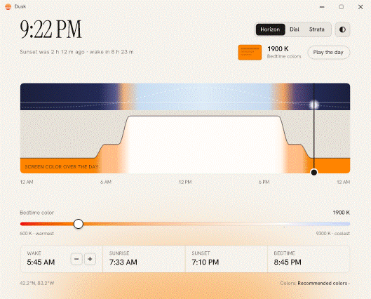 |  |

## How the day works

You give Dusk two things once: where you are and when you wake up.

- **Daytime colours** run from sunrise to sunset.
- **Sunset colours** run from sunset until bedtime, and again from waking until sunrise.
- **Bedtime colours** run from bedtime (9 hours before you wake) until you wake.

Each change blends over 45 minutes, so nothing switches abruptly. Pick a preset on the Colors screen or set each of the three colours yourself.

## Screens

| | Light | Dark |
| --- | --- | --- |
| **Horizon** — the sun's path over the day's colour |  | 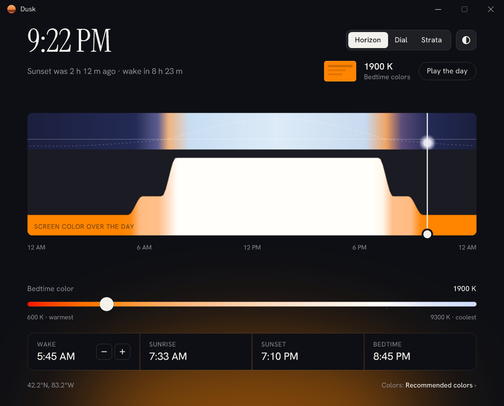 |
| **Dial** — the day as a ring | 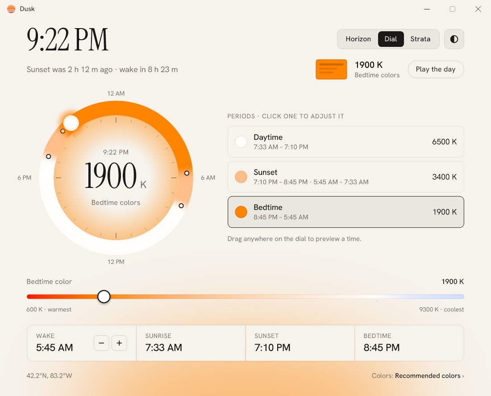 | 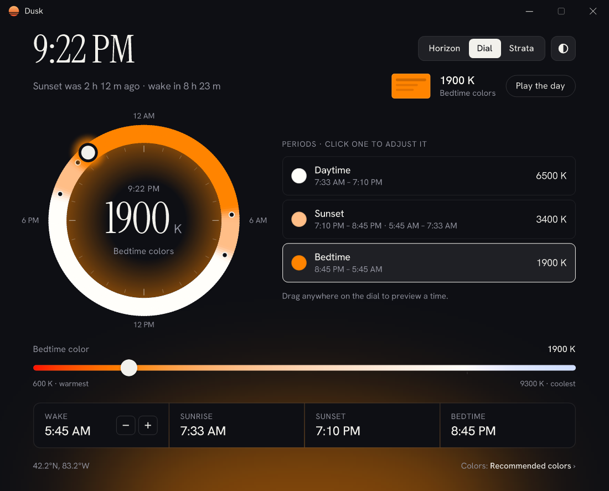 |
| **Strata** — stacked from the moment you wake | 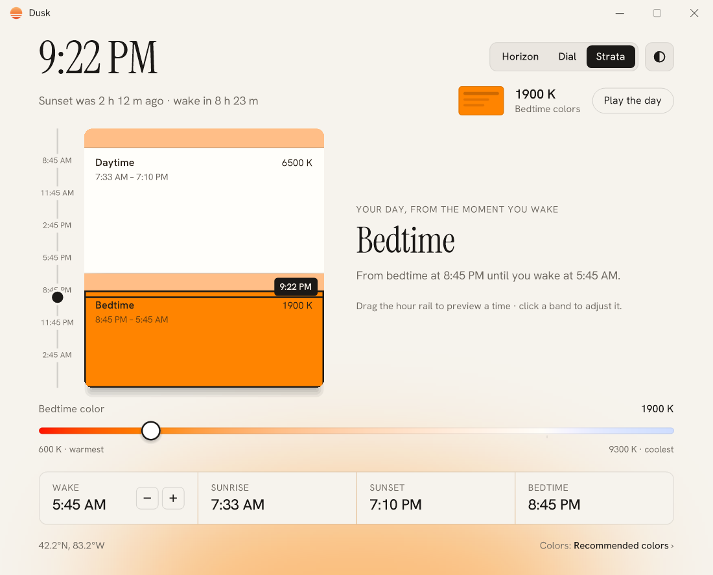 | 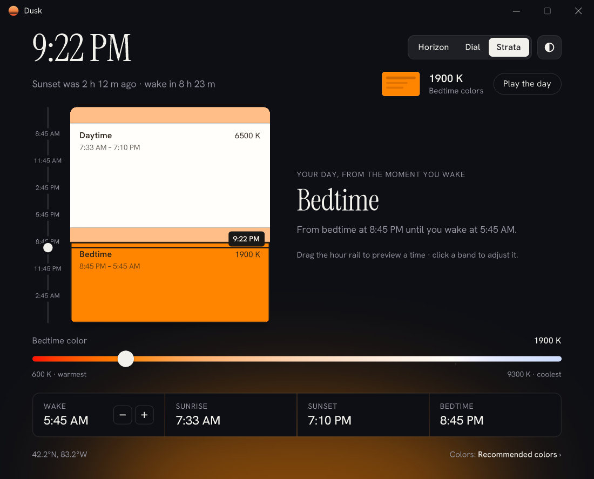 |
| **Colors** — presets and one slider per colour | 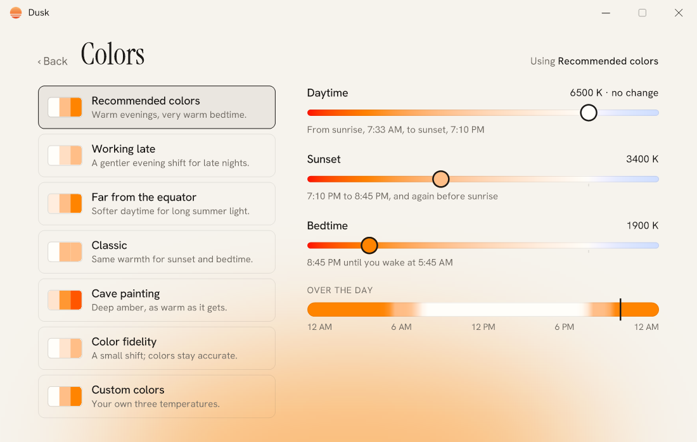 | 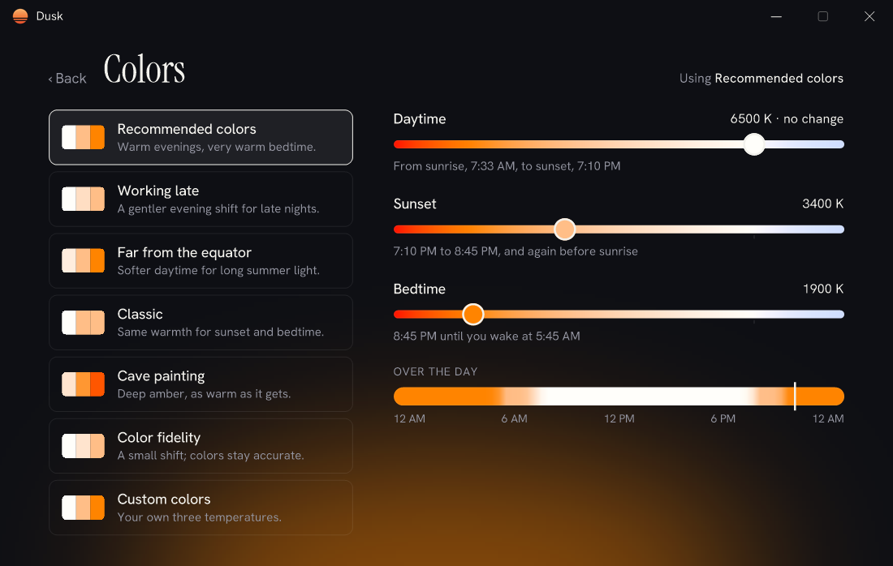 |
| **First run** — two questions, once | 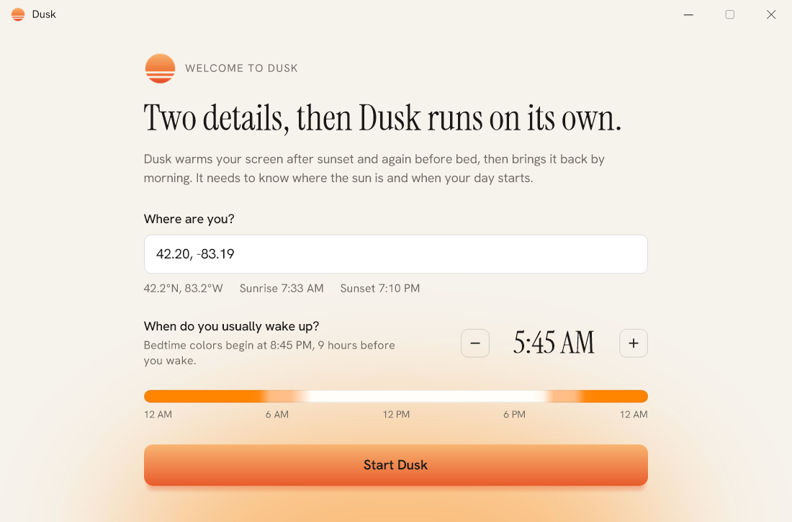 | 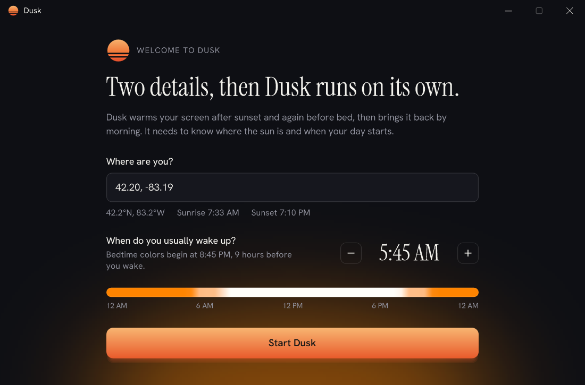 |
| **Tray flyout** — status and quick ways to switch off | 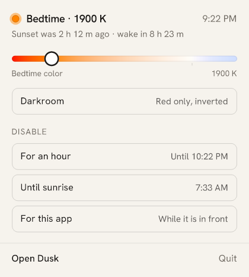 | 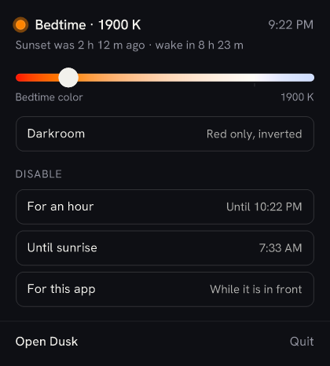 |

Daytime, for contrast: [light](docs/screenshots/horizon-day-light.png) · [dark](docs/screenshots/horizon-day-dark.png)

## Install

**Download** the latest `Dusk.exe` from [Releases](https://github.com/YOUR-USERNAME/dusk/releases), put it anywhere and run it. Windows 10 or 11, nothing else required.

Prefer an installer? Grab `DuskSetup-x.y.z.exe` from the same page. It installs for your user only, with no admin prompt, and starts Dusk with Windows.

**First run** asks where you are (a city name, or coordinates like `42.2, -83.2`) and when you wake up. After that Dusk stays in the tray.

## Shortcuts

| Keys | Action |
| --- | --- |
| Alt+PgUp / Alt+PgDn | Make the current part of the day 100K cooler / warmer |
| Alt+End | Turn Dusk off for an hour, or leave Darkroom |
| Alt+Home | Open Dusk |

The tray flyout can also switch Dusk off for an hour, until sunrise, or whenever a particular app is in front.

## Darkroom

Past the warm end of the slider there's Darkroom: red only, inverted and dimmed, for reading at night without lighting up the room. Turn it on from the tray flyout; Alt+End leaves it.

| Darkroom on | The flyout |
| --- | --- |
| 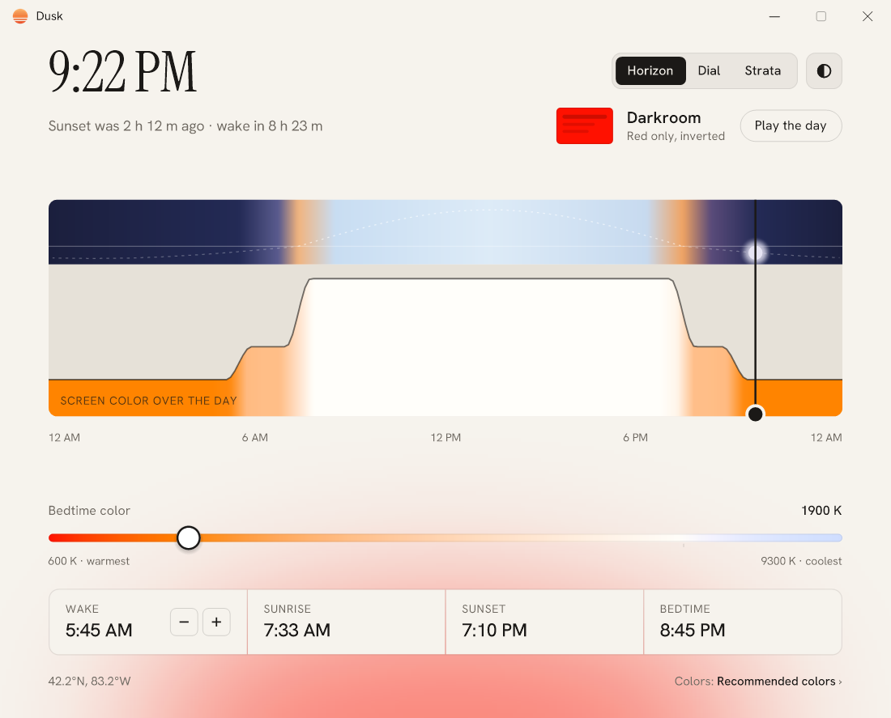 | 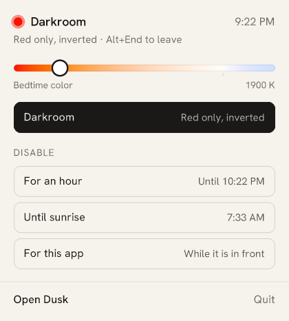 |

## How it works

- **Colour.** The table comes from Planck's law and the CIE 1931 observer, converted to sRGB and normalised so 6500K is unchanged. Below about 1000K a blackbody falls outside what a screen can show, so the curve continues smoothly instead of flattening: green is gone by 700K, and from 800K down the red itself dims, which is the only way left to get warmer.
- **Applying it.** Per-monitor gamma ramps (`SetDeviceGammaRamp`). HDR and auto-colour-managed displays ignore those, so Dusk detects advanced colour through DisplayConfig and falls back to a full-screen colour matrix.
- **The sun.** Sunrise and sunset are computed locally from your coordinates, so the schedule works offline.
- **The window.** Drawn directly with GDI+ on plain Win32 windows: no WPF, no WinForms, no browser engine. It paints into a back buffer, frees it on hide and hands the memory back to Windows.

Roughly 4.6k lines of C#, no third-party packages, built by the compiler already in Windows.

## Dusk and f.lux

f.lux is excellent, and Dusk owes it the idea. Measured on the same PC:

| | Dusk | f.lux |
| --- | --- | --- |
| Slider range | 600K–9300K | 1200K–9300K |
| Darkroom mode | yes | yes |
| Memory, window open | 8–13 MB | 5 MB |
| Memory, idle in the tray | under 3 MB | — |
| Download | 345 KB, single file | 1.47 MB installer |
| Colour source | Planck's law + CIE 1931 | curve fit |
| Schedule | wake time, sunrise, sunset, bedtime | the same idea |

f.lux is the more mature app: per-app rules, smart-light integration and years of tuning. Dusk goes warmer, installs nothing and keeps its maths under test.

## Build

Dusk builds with the C# compiler that ships with Windows (.NET Framework 4.8). There is nothing to install.

```
build.cmd
```

That produces `bin\Dusk.exe` (32-bit, fonts embedded) and `bin\DuskTests.exe`. Run the tests:

```
bin\DuskTests.exe
```

Add `--online` to also check the place lookup. For a release zip, run `scripts\package.cmd v1.0.0`; to rebuild the images in this README, run `scripts\make-media.cmd`.

### Development options

| Option | What it does |
| --- | --- |
| `--preview` | Never changes screen colours, saves settings or touches Windows startup |
| `--skip-setup` | Opens the main window without going through first run |
| `--snapshot out.png` | Renders a screen to a PNG and exits (`--screen`, `--theme`, `--hour`, `--scale`) |
| `--trace` | Logs mouse, key and paint events to `%TEMP%\dusk-trace.log` |

## Project layout

```
src/            the app: colour, schedule, solar maths, Win32 plumbing
src/Ui/         windows, drawing, the three day views
tools/          tests, icon generator, GIF builder
scripts/        packaging and media generation
installer/      Inno Setup script for the optional installer
docs/           screenshots, demos, publishing guide
```

## Privacy

Dusk has no telemetry and no update pings. The one network call it can make is looking up a city name you type during setup, which goes to [Open-Meteo](https://open-meteo.com/)'s free geocoding service. Typing coordinates skips that entirely. Settings live in `%APPDATA%\Dusk\settings.ini`.

## Licence

[MIT](LICENSE). The embedded fonts, Instrument Serif and Hanken Grotesk, are used under the SIL Open Font License.
